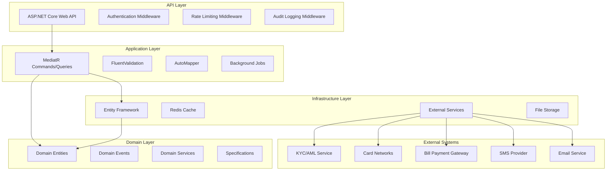
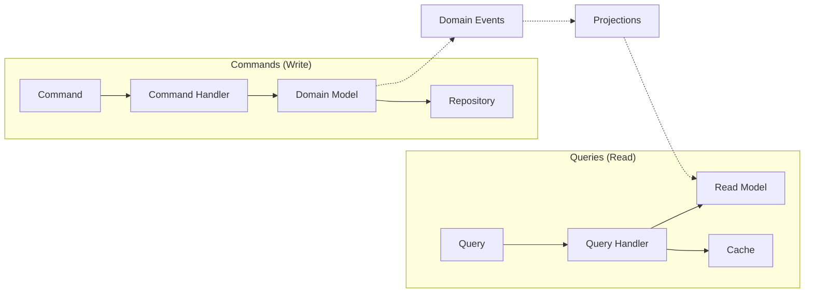

# Complete Banking Backend - Design Document

## Overview

The Complete Banking Backend extends the existing .NET 9.0 banking system with comprehensive banking features including loan management, card services, bill payments, KYC/AML compliance, and advanced security. The system maintains Clean Architecture principles while adding new domain services, event-driven processing, and regulatory compliance capabilities.

### Key Design Principles

- **Clean Architecture**: Maintain separation of concerns across API, Application, Domain, and Infrastructure layers
- **CQRS with MediatR**: Separate read and write operations for better performance and scalability
- **Event-Driven Architecture**: Use domain events for loose coupling and audit trails
- **Security First**: Implement comprehensive security measures including 2FA, rate limiting, and fraud detection
- **Regulatory Compliance**: Built-in KYC/AML monitoring and audit logging
- **Microservices Ready**: Design for future decomposition into microservices

### Technology Stack

- **.NET 9.0** with ASP.NET Core
- **Entity Framework Core** for data access
- **MediatR** for CQRS implementation
- **Hangfire** for background job processing
- **Redis** for caching and session management
- **JWT** with refresh tokens for authentication
- **FluentValidation** for request validation
- **AutoMapper** for object mapping
- **Serilog** for structured logging

## Architecture

### System Architecture Overview



### Clean Architecture Layers

#### API Layer
- **Controllers**: RESTful endpoints for all banking operations
- **Middleware**: Authentication, authorization, rate limiting, audit logging
- **DTOs**: Request/response data transfer objects
- **Filters**: Global exception handling and validation

#### Application Layer
- **Commands/Queries**: CQRS implementation using MediatR
- **Handlers**: Business logic orchestration
- **Validators**: Input validation using FluentValidation
- **Services**: Application services for complex workflows
- **Background Jobs**: Hangfire jobs for async processing

#### Domain Layer
- **Entities**: Core business entities (Loan, Card, Beneficiary, etc.)
- **Value Objects**: Immutable objects representing domain concepts
- **Domain Events**: Events published during business operations
- **Domain Services**: Business logic that doesn't belong to entities
- **Specifications**: Query specifications for complex filtering

#### Infrastructure Layer
- **Repositories**: Data access implementations
- **External Services**: Third-party service integrations
- **Event Handlers**: Domain event processing
- **File Storage**: Document and statement storage
- **Caching**: Redis-based caching implementation

### CQRS Implementation



### Event-Driven Architecture

The system uses domain events for:
- **Audit Logging**: All business operations generate audit events
- **Notifications**: Transaction and account events trigger notifications
- **Compliance**: KYC/AML events for regulatory monitoring
- **Integration**: Events for external system synchronization
- **Projections**: Read model updates from domain events

## Components and Interfaces

### Core Domain Entities

#### Loan Entity
```csharp
public class Loan : BaseEntity
{
    public string LoanNumber { get; set; }
    public string CustomerId { get; set; }
    public LoanType Type { get; set; }
    public decimal PrincipalAmount { get; set; }
    public decimal InterestRate { get; set; }
    public int TermInMonths { get; set; }
    public LoanStatus Status { get; set; }
    public DateTime ApplicationDate { get; set; }
    public DateTime? ApprovalDate { get; set; }
    public DateTime? DisbursementDate { get; set; }
    public decimal OutstandingBalance { get; set; }
    public List<LoanPayment> Payments { get; set; }
    public List<LoanDocument> Documents { get; set; }
}
```

#### Card Entity
```csharp
public class Card : BaseEntity
{
    public string CardNumber { get; set; }
    public string CustomerId { get; set; }
    public string AccountId { get; set; }
    public CardType Type { get; set; }
    public CardStatus Status { get; set; }
    public DateTime ExpiryDate { get; set; }
    public decimal DailyLimit { get; set; }
    public decimal MonthlyLimit { get; set; }
    public bool ContactlessEnabled { get; set; }
    public List<CardTransaction> Transactions { get; set; }
}
```

#### Beneficiary Entity
```csharp
public class Beneficiary : BaseEntity
{
    public string CustomerId { get; set; }
    public string Name { get; set; }
    public string AccountNumber { get; set; }
    public string BankCode { get; set; }
    public string SwiftCode { get; set; }
    public BeneficiaryType Type { get; set; }
    public BeneficiaryCategory Category { get; set; }
    public bool IsVerified { get; set; }
    public decimal TransferLimit { get; set; }
    public List<Transfer> Transfers { get; set; }
}
```

### Service Interfaces

#### ILoanService
```csharp
public interface ILoanService
{
    Task<LoanApplicationResult> SubmitApplicationAsync(LoanApplicationRequest request);
    Task<CreditScoreResult> PerformCreditScoringAsync(string customerId);
    Task<LoanApprovalResult> ProcessApprovalAsync(string loanId, ApprovalDecision decision);
    Task<DisbursementResult> DisburseLoanAsync(string loanId);
    Task<PaymentResult> ProcessPaymentAsync(string loanId, decimal amount);
    Task<List<Loan>> GetCustomerLoansAsync(string customerId);
    Task<RepaymentSchedule> GenerateRepaymentScheduleAsync(string loanId);
}
```

#### ICardService
```csharp
public interface ICardService
{
    Task<CardIssuanceResult> IssueCardAsync(CardIssuanceRequest request);
    Task<ActivationResult> ActivateCardAsync(string cardId, string activationCode);
    Task<BlockResult> BlockCardAsync(string cardId, BlockReason reason);
    Task<LimitUpdateResult> UpdateLimitsAsync(string cardId, LimitUpdateRequest request);
    Task<List<CardTransaction>> GetCardTransactionsAsync(string cardId, DateRange dateRange);
    Task<PinChangeResult> ChangePinAsync(string cardId, PinChangeRequest request);
}
```

#### IBeneficiaryService
```csharp
public interface IBeneficiaryService
{
    Task<BeneficiaryResult> AddBeneficiaryAsync(AddBeneficiaryRequest request);
    Task<VerificationResult> VerifyBeneficiaryAsync(string beneficiaryId);
    Task<List<Beneficiary>> GetCustomerBeneficiariesAsync(string customerId);
    Task<UpdateResult> UpdateBeneficiaryAsync(string beneficiaryId, UpdateBeneficiaryRequest request);
    Task<DeleteResult> DeleteBeneficiaryAsync(string beneficiaryId);
    Task<ValidationResult> ValidateBeneficiaryAccountAsync(string accountNumber, string bankCode);
}
```

### External Service Integrations

#### IKycService
```csharp
public interface IKycService
{
    Task<IdentityVerificationResult> VerifyIdentityAsync(IdentityVerificationRequest request);
    Task<RiskAssessmentResult> AssessCustomerRiskAsync(string customerId);
    Task<WatchlistCheckResult> CheckWatchlistsAsync(CustomerInfo customer);
    Task<DocumentVerificationResult> VerifyDocumentAsync(DocumentVerificationRequest request);
}
```

#### ICardNetworkService
```csharp
public interface ICardNetworkService
{
    Task<AuthorizationResult> AuthorizeTransactionAsync(AuthorizationRequest request);
    Task<SettlementResult> SettleTransactionsAsync(List<CardTransaction> transactions);
    Task<DisputeResult> ProcessChargebackAsync(ChargebackRequest request);
    Task<CardValidationResult> ValidateCardAsync(string cardNumber);
}
```

## Data Models

### Database Schema Design

#### Core Banking Tables
```sql
-- Loans table
CREATE TABLE Loans (
    Id UNIQUEIDENTIFIER PRIMARY KEY,
    LoanNumber NVARCHAR(20) UNIQUE NOT NULL,
    CustomerId UNIQUEIDENTIFIER NOT NULL,
    Type INT NOT NULL,
    PrincipalAmount DECIMAL(18,2) NOT NULL,
    InterestRate DECIMAL(5,4) NOT NULL,
    TermInMonths INT NOT NULL,
    Status INT NOT NULL,
    ApplicationDate DATETIME2 NOT NULL,
    ApprovalDate DATETIME2 NULL,
    DisbursementDate DATETIME2 NULL,
    OutstandingBalance DECIMAL(18,2) NOT NULL DEFAULT 0,
    CreatedAt DATETIME2 NOT NULL DEFAULT GETUTCDATE(),
    UpdatedAt DATETIME2 NOT NULL DEFAULT GETUTCDATE(),
    FOREIGN KEY (CustomerId) REFERENCES AspNetUsers(Id)
);

-- Cards table
CREATE TABLE Cards (
    Id UNIQUEIDENTIFIER PRIMARY KEY,
    CardNumber NVARCHAR(19) UNIQUE NOT NULL,
    CustomerId UNIQUEIDENTIFIER NOT NULL,
    AccountId UNIQUEIDENTIFIER NOT NULL,
    Type INT NOT NULL,
    Status INT NOT NULL,
    ExpiryDate DATE NOT NULL,
    DailyLimit DECIMAL(18,2) NOT NULL DEFAULT 5000,
    MonthlyLimit DECIMAL(18,2) NOT NULL DEFAULT 50000,
    ContactlessEnabled BIT NOT NULL DEFAULT 1,
    CreatedAt DATETIME2 NOT NULL DEFAULT GETUTCDATE(),
    UpdatedAt DATETIME2 NOT NULL DEFAULT GETUTCDATE(),
    FOREIGN KEY (CustomerId) REFERENCES AspNetUsers(Id),
    FOREIGN KEY (AccountId) REFERENCES Accounts(Id)
);

-- Beneficiaries table
CREATE TABLE Beneficiaries (
    Id UNIQUEIDENTIFIER PRIMARY KEY,
    CustomerId UNIQUEIDENTIFIER NOT NULL,
    Name NVARCHAR(100) NOT NULL,
    AccountNumber NVARCHAR(20) NOT NULL,
    BankCode NVARCHAR(10) NOT NULL,
    SwiftCode NVARCHAR(11) NULL,
    Type INT NOT NULL,
    Category INT NOT NULL,
    IsVerified BIT NOT NULL DEFAULT 0,
    TransferLimit DECIMAL(18,2) NOT NULL DEFAULT 100000,
    CreatedAt DATETIME2 NOT NULL DEFAULT GETUTCDATE(),
    UpdatedAt DATETIME2 NOT NULL DEFAULT GETUTCDATE(),
    FOREIGN KEY (CustomerId) REFERENCES AspNetUsers(Id)
);
```

#### Audit and Compliance Tables
```sql
-- Audit logs table
CREATE TABLE AuditLogs (
    Id UNIQUEIDENTIFIER PRIMARY KEY,
    UserId UNIQUEIDENTIFIER NULL,
    Action NVARCHAR(100) NOT NULL,
    EntityType NVARCHAR(50) NOT NULL,
    EntityId NVARCHAR(50) NOT NULL,
    OldValues NVARCHAR(MAX) NULL,
    NewValues NVARCHAR(MAX) NULL,
    IpAddress NVARCHAR(45) NULL,
    UserAgent NVARCHAR(500) NULL,
    Timestamp DATETIME2 NOT NULL DEFAULT GETUTCDATE(),
    FOREIGN KEY (UserId) REFERENCES AspNetUsers(Id)
);

-- KYC records table
CREATE TABLE KycRecords (
    Id UNIQUEIDENTIFIER PRIMARY KEY,
    CustomerId UNIQUEIDENTIFIER NOT NULL,
    DocumentType INT NOT NULL,
    DocumentNumber NVARCHAR(50) NOT NULL,
    VerificationStatus INT NOT NULL,
    VerificationDate DATETIME2 NULL,
    ExpiryDate DATE NULL,
    RiskLevel INT NOT NULL DEFAULT 1,
    LastReviewDate DATETIME2 NULL,
    NextReviewDate DATETIME2 NULL,
    CreatedAt DATETIME2 NOT NULL DEFAULT GETUTCDATE(),
    UpdatedAt DATETIME2 NOT NULL DEFAULT GETUTCDATE(),
    FOREIGN KEY (CustomerId) REFERENCES AspNetUsers(Id)
);

-- AML alerts table
CREATE TABLE AmlAlerts (
    Id UNIQUEIDENTIFIER PRIMARY KEY,
    CustomerId UNIQUEIDENTIFIER NOT NULL,
    TransactionId UNIQUEIDENTIFIER NULL,
    AlertType INT NOT NULL,
    RiskScore DECIMAL(5,2) NOT NULL,
    Status INT NOT NULL,
    Description NVARCHAR(500) NOT NULL,
    CreatedAt DATETIME2 NOT NULL DEFAULT GETUTCDATE(),
    ReviewedAt DATETIME2 NULL,
    ReviewedBy UNIQUEIDENTIFIER NULL,
    Resolution NVARCHAR(1000) NULL,
    FOREIGN KEY (CustomerId) REFERENCES AspNetUsers(Id),
    FOREIGN KEY (TransactionId) REFERENCES Transactions(Id),
    FOREIGN KEY (ReviewedBy) REFERENCES AspNetUsers(Id)
);
```

### Performance Indexes

```sql
-- Loan indexes
CREATE INDEX IX_Loans_CustomerId ON Loans(CustomerId);
CREATE INDEX IX_Loans_Status ON Loans(Status);
CREATE INDEX IX_Loans_ApplicationDate ON Loans(ApplicationDate);

-- Card indexes
CREATE INDEX IX_Cards_CustomerId ON Cards(CustomerId);
CREATE INDEX IX_Cards_AccountId ON Cards(AccountId);
CREATE INDEX IX_Cards_Status ON Cards(Status);

-- Beneficiary indexes
CREATE INDEX IX_Beneficiaries_CustomerId ON Beneficiaries(CustomerId);
CREATE INDEX IX_Beneficiaries_AccountNumber_BankCode ON Beneficiaries(AccountNumber, BankCode);

-- Audit indexes
CREATE INDEX IX_AuditLogs_UserId_Timestamp ON AuditLogs(UserId, Timestamp);
CREATE INDEX IX_AuditLogs_EntityType_EntityId ON AuditLogs(EntityType, EntityId);

-- KYC indexes
CREATE INDEX IX_KycRecords_CustomerId ON KycRecords(CustomerId);
CREATE INDEX IX_KycRecords_NextReviewDate ON KycRecords(NextReviewDate);

-- AML indexes
CREATE INDEX IX_AmlAlerts_CustomerId_Status ON AmlAlerts(CustomerId, Status);
CREATE INDEX IX_AmlAlerts_CreatedAt ON AmlAlerts(CreatedAt);
```

### Data Encryption Strategy

#### Encryption at Rest
- **Sensitive Fields**: Card numbers, account numbers, SSNs encrypted using AES-256
- **Database**: Transparent Data Encryption (TDE) for entire database
- **Key Management**: Azure Key Vault or AWS KMS for key rotation
- **Backup Encryption**: All backups encrypted with separate keys

#### Encryption in Transit
- **API Communication**: TLS 1.3 for all external communication
- **Internal Services**: mTLS for service-to-service communication
- **Database Connections**: Encrypted connections with certificate validation
- **File Transfers**: SFTP or HTTPS for document transfers

```csharp
// Example encryption service
public class EncryptionService : IEncryptionService
{
    public string EncryptSensitiveData(string plainText, string keyId)
    {
        // Implementation using Azure Key Vault or similar
    }
    
    public string DecryptSensitiveData(string cipherText, string keyId)
    {
        // Implementation using Azure Key Vault or similar
    }
}
```