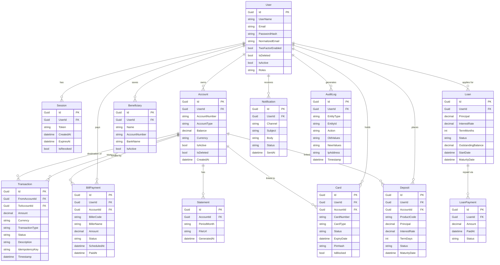

# Entity Relationship Diagram

## Domain Overview

The Bank API domain is organized around nine business modules.
The diagram below shows the primary entities, their key attributes,
and how they relate across the system.

---

## ERD

---

## Key Design Notes

| Aspect | Decision |
|---|---|
| **Soft delete** | All core entities use `IsDeleted` flag; no hard deletes on financial data |
| **Currency** | Stored as string (ISO 4217 code) alongside every monetary amount |
| **Idempotency** | `Transaction` carries an `IdempotencyKey` to prevent duplicate processing |
| **Audit trail** | `AuditLog` is immutable — no updates or deletes allowed on audit rows |
| **Module ownership** | Each cluster of entities is owned by exactly one module (see `ADR-001`) |
| **Cross-module access** | Modules communicate via `Bank.Contracts` events, not direct table joins |